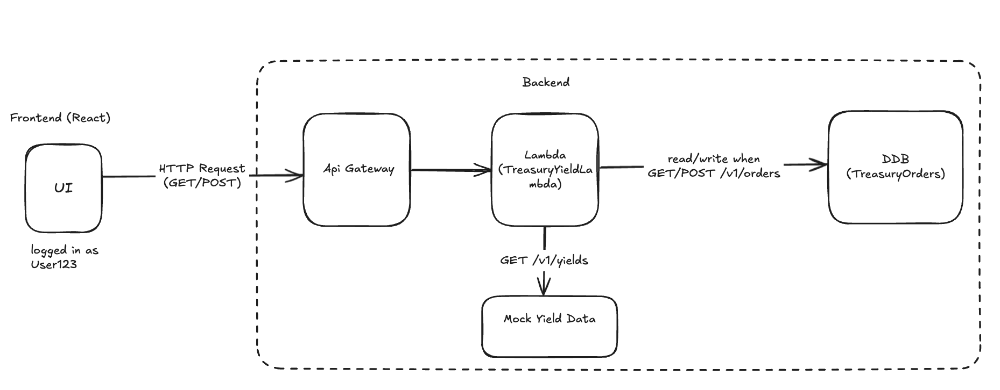

# Treasury Yield Curve Order App

A full-stack serverless application that allows users to view treasury yield curve data and place investment orders based on the selected term and rate. The application is built with **React**, **AWS Lambda**, **API Gateway**, and **DynamoDB**, and is fully deployable via **AWS CDK**.

---

## High-Level Architecture Diagram



1. **Frontend (React)** – Displays the yield curve, provides an investment form, and shows past orders.
2. **API Gateway** – Exposes RESTful HTTP endpoints to the frontend.
3. **AWS Lambda** – Handles API requests for yield data and investment orders.
4. **DynamoDB** – Stores submitted orders in a table named `TreasuryOrders`.

---

## Tech Stack

| Layer          | Technology                      |
|----------------| ------------------------------- |
| Frontend       | React + Tailwind CSS            |
| Backend        | AWS Lambda (Node.js)            |
| API Gateway    | AWS API Gateway                 |
| Persistence    | AWS DynamoDB                    |
| Infrastructure | AWS CDK (TypeScript)            |

---

## Getting Started

### Prerequisites

- [Node.js ≥ 18](https://docs.npmjs.com/downloading-and-installing-node-js-and-npm)
- [AWS CLI configured](https://docs.aws.amazon.com/cli/latest/userguide/getting-started-quickstart.html)
- [AWS CDK v2](https://docs.aws.amazon.com/cdk/v2/guide/getting-started.html) — install via:
     ```bash
    npm install -g aws-cdk
    ```
- [Docker](https://www.docker.com/) — required for bundling Lambda code

---

### Step 1: Deploy the Backend
From the root of the project:

```bash
cd infrastructure/aws
```
Make sure Docker is running, then execute:

```bash
./dev-deploy.sh
```

This deploys:
- API Gateway endpoint
- Lambda function with route handlers
- DynamoDB table for storing orders

| 🐳 Note: Docker is required for bundling the Lambda function. Ensure it’s running before executing the script.

| 📘 After deployment, the API Gateway URL will be printed in your terminal — you’ll need it in the next step.

### Step 2: Set Up Environment Variables
Navigate to the frontend directory:

```bash
cd ../../treasury-yield-app
```
Create a .env file and add the following:

```bash
VITE_API_GATEWAY_URL=https://<your-api-id>.execute-api.<region>.amazonaws.com/dev/
```
Replace `<your-api-id>` and `<region>` with the actual values printed after deployment.


### Step 3: Start the Frontend App

```bash
npm install
npm run dev
```

Once started, the app will be available at: http://localhost:5173

## App Demo
[Watch App Demo](https://www.youtube.com/watch?v=mBTYkhk5AfA)